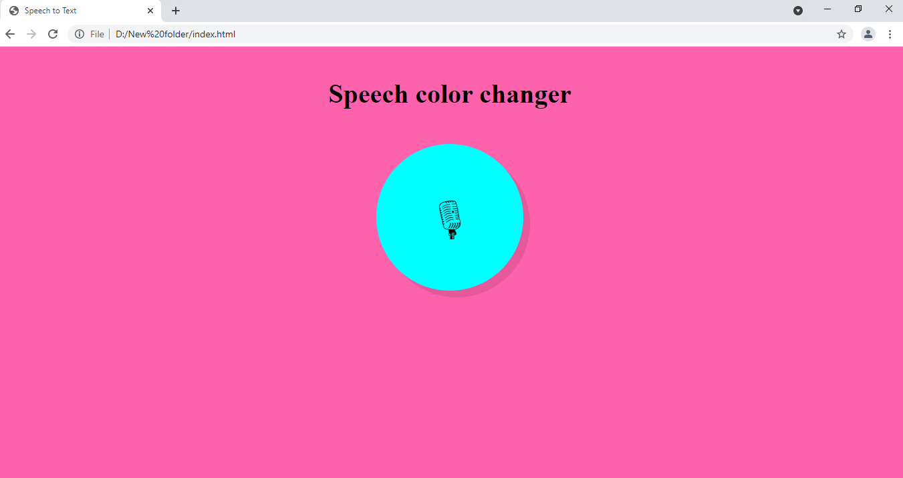
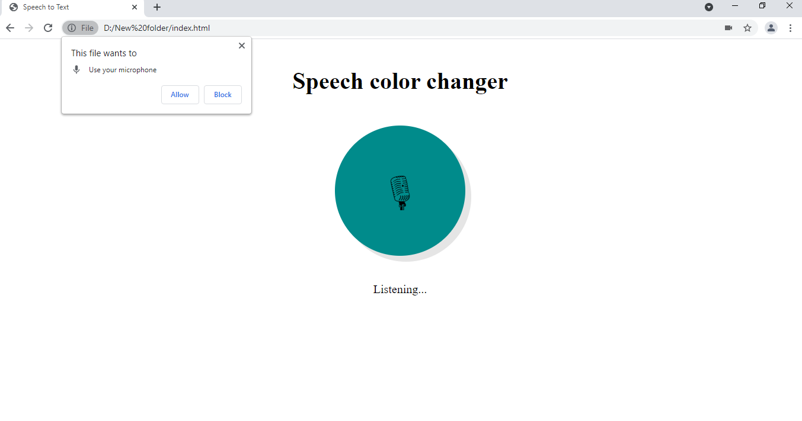
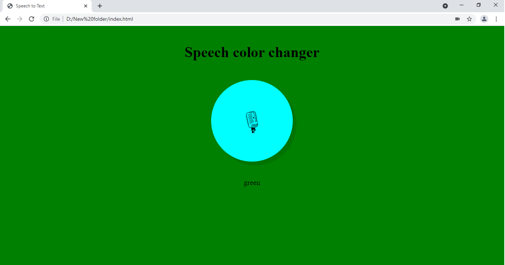

# Say-the-color-and-it-changes
This is an HTML, CSS, JavaScript based project which changes the background of the web page to which it is said through the mic.

Here are few images of this interesting project:

